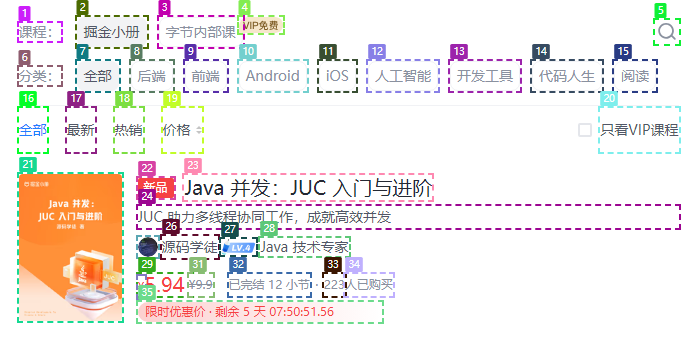

### 测试对象


### 视觉标记后



### 测试目标

识别出对象中哪些节点存在超出的情况

### 测试结果

第一次结果正确识别到 3、4 之间存在了超出关系

```json
{
  "briefExplanation": "The search input box element is extending beyond its container bounds.",
  "bug": {
    "type": "overflow",
    "element": [3],
    "reason": "搜索框的右侧部分超出了其父容器的边界。"
  }
}
```

解释：

1. 元素 3 的搜索输入框已溢出其指定容器。这个问题的直观表现是搜索框的右侧被切断或超出了其父容器的边界。


### prompt

今日调整：

1. 缩减任务数量减少至 “识别超出容器”
2. 添加原图片，作为在对照图
3. 添加 0-shot 思路链条，通过添加短语 “让我们一个一个地将元素进行对比”

```
任务: 分析这张图片，识别出超出容器的标记元素。

## 超出容器
type OverflowAction = { type: "overflow", element: number[], reason: string }

## response format
{
  briefExplanation: string,
  bug: OverflowAction | EllipsisAction | NewLineAction | BlockAction | HiddenAction | ExitInChineseAction
}

## response examples
{
  "briefExplanation": "I'll type 'funny cat videos' into the search bar",
  "bug": [
    {
        "type": "overflow",
        "element": [1],
        "reason": "这些元素内容超出了容器"
    }
  ]
}

## 指令
# 你是一个专业的视觉设计师，现在需要你检查页面布局。
# 你需要以逐步的方式解决问题，将元素逐个进行对比，以确保获得正确的答案。判定超出容器：截断的文字、越过指定区域边界、元素未完全包含。
# 第一张图片是网页的截图，第二张图片是根据第一张图片中页面元素使用 COCO Annotator进行数字标记；注意用于标记元素的边框不属于元素自身。
# 只提供一个JSON格式的输出，归类并描述这些布局问题。
```

