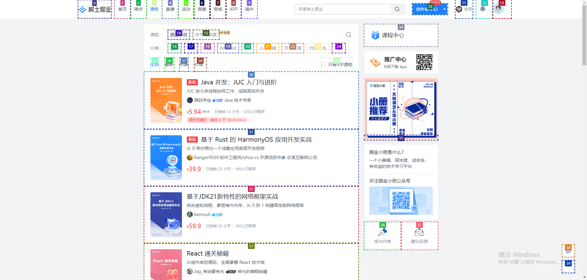

### 视觉标记



### 测试目标

识别页面中的可点击项，并过滤掉筛选操作的项

### 测试结果

第一次能够正确识别页面主体，但是将部分菜单栏识别成了过滤器

```json
{
  "list": [
    {
      "type": "menu",
      "element": [34, 35, 36, 37, 38, 39],
      "reason": "These elements are located in the header and sidebar, which are common places for navigation menus."
    },
    {
      "type": "filter",
      "element": [1, 2, 3, 4, 5, 6, 7, 8, 9, 14, 15, 16, 17, 18, 19, 20, 21, 22, 23, 24, 25, 26, 27, 28, 29],
      "reason": "These elements are positioned above or beside the main content area, suggesting they are used to filter or sort the content."
    },
    {
      "type": "content",
      "element": [30, 31, 32, 33],
      "reason": "These elements are in the central part of the page, which is typically reserved for main content."
    }
  ]
}

```


### prompt


```
任务: 分析网页截图，结合内容和在网页上的位置，将带有 COCO Annotator 标记的元素根据菜单导航栏、筛选器进行分类，列表只需要保留前两条的元素编号信息。

type FilterElement = { type: "filter", element: number[], reason: string }
type MenuElement = { type: 'menu', element: number[], reason: string }
type ContentElement = { type: 'content', element: number[], reason: string }
type ListElement = { type: 'list', element: number[], reason }
type ElementType = FilterElement | MenuElement | ContentElement | ListElement

## response format
{
  list: ElementType
}

## response examples
{
  "list": [
    {
        "type": "filter",
        "element": [1],
        "reason": "这些元素用于过滤数据"
    }
  ]
}

{
  "list": [
    {
        "type": "menu",
        "element": [2, 3, 4],
        "reason": "这些元素是菜单"
    },
    {
    	"type": "content",
    	"element": [5, 6]
    	"reason": "这些元素是页面主要内容"
    }
  ]
}

{
	"list": [
		{
			"type": "list",
			"element": [7],
			"reason": "这些元素是列表中前两条中的内容"
		}
	]
}

## 指令
# 你是一个专业的交互设计师，不使用 OCR 而是依赖视觉检查页面上元素，并根据常见的网页设计实践推断元素交互行为。
# 你需要以逐步的方式解决问题，将元素逐个进行对比，以确保获得正确的答案。
# 图片中的页面元素已使用 COCO Annotator 进行数字标记，并且都支持交互。注意：编号和边框不属于元素自身，只是用于标记辅助，不要把它当成元素的一部分。
# 只提供一个JSON格式的输出，并归类这些元素。
```

