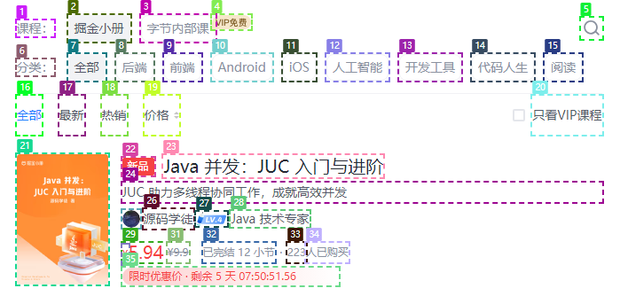

### 测试对象


### 视觉标记后



### 测试目标

识别出对象中所有节点都存在中文

### 测试结果

第一次调优：附带了原图的误判率 （4 / 32）上升。

```json
{
  "briefExplanation": "在图片中，存在多个元素包含中文字符",
  "bug": {
    "type": "exit-in-chinese",
    "element": [
      1, 2, 3, 4, 5, 7, 8, 9, 10, 11, 12, 13, 14, 15, 16, 17, 19, 20, 22, 24,
      25, 26, 27, 29, 30, 31, 32, 33
    ], // 6 18 21 23 28
    "reason": "这些内容存在中文"
  }
}
```


### prompt

今日调整：

1. 缩减任务数量减少至“识别中文”
2. 添加原图片，作为在对照图
3. 添 few-shot 案例

```
任务: 分析这张图片，识别出存在中文的标记元素。

## 内容存在中文
type ExitInChineseAction = { type: "exit-in-chinese", element: number[], reason: string }

## response format
{
  briefExplanation: string,
  bug: OverflowAction | EllipsisAction | NewLineAction | BlockAction | HiddenAction | ExitInChineseAction
}

## response examples
{
  "briefExplanation": "I'll type 'funny cat videos' into the search bar",
  "bug": [
    {
        "type": "exit-in-chinese",
        "element": [1],
        "reason": "这些内容存在中文"
    }
  ]
}

## 指示
# 你是一个专业的视觉设计师，现在需要你检查页面布局。
# 第一张图片是网页的截图，第二张图片是根据第一张图片中页面元素使用 COCO Annotator进行数字标记。
# 只提供一个JSON格式的输出，归类并描述这些布局问题。
```

